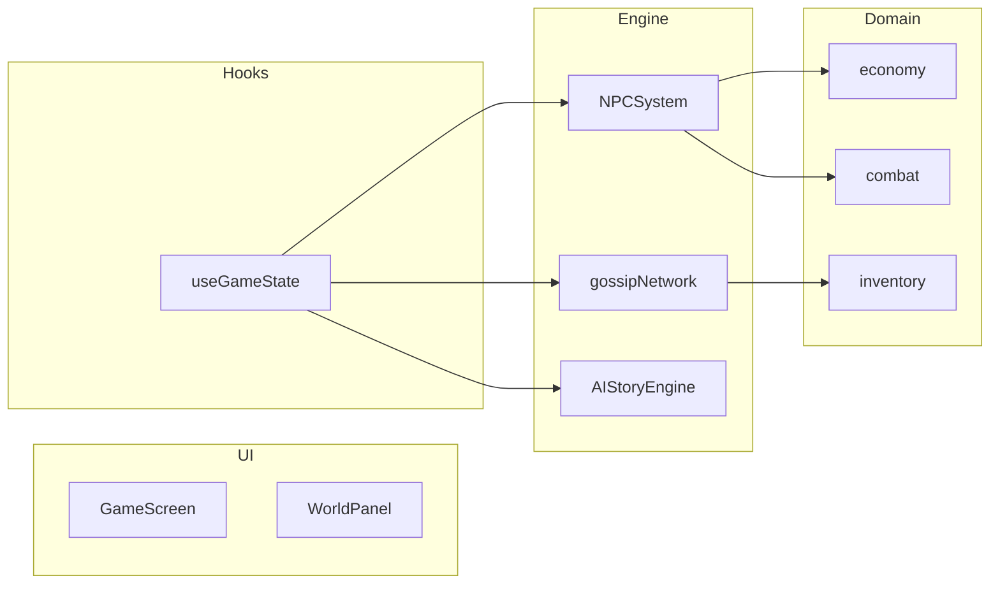

# DEEP ENGINEERING AUDIT REPORT
**Chronos: AI Chronicles** — полный инженерный аудит проекта

---

## Executive Summary

| Метрика | Значение |
|---------|----------|
| Файлов TS/TSX | 235 |
| Строк кода | 35,166 |
| Тестовое покрытие | 55.71% |
| Циклические зависимости | **NONE** |
| Архитектура | layered (UI → hooks → engine → domain → types) |

---

## Step 1: Structural Analysis

### Технологический стек

| Категория | Технология | Версия |
|----------|------------|-------|
| Frontend | React | 19.2.0 |
| Build | Vite | 7.2.4 |
| 3D Rendering | Three.js + R3F | 0.184.0 |
| Desktop | Electron | 35.7.5 |
| Testing | Vitest + Playwright | 4.1.5 / 1.59.1 |
| AI Dialogue | @mlc-ai/web-llm | 0.2.79 |
| i18n | Custom (ru/en) | — |
| Storage | IndexedDB | — |
| UI | Radix UI + Tailwind | 1.2.x / 3.4.19 |

### Top-10 файлов по размеру

| Файл | Строк | Назначение |
|-------|-------|-----------|
| useGameState.ts | 1897 | Central game state hook |
| WorldScene3D.tsx | 1703 | 3D world rendering |
| GameScreen.tsx | 1064 | Main game container |
| NPCSystem.ts | 968 | NPC simulation engine |
| i18n/index.ts | 906 | Localization |
| AIStoryEngine.ts | 788 | AI narrative generation |
| storyLocale.ts | 756 | Story content |
| game.ts | 746 | Core types |
| WorldCanvas.tsx | 736 | 2D tactical map |
| sidebar.tsx | 726 | UI navigation |

---

## Step 2: Dependency Analysis

### Circular Dependencies
```
✔ No circular dependency found!
```
Проверено через `madge --circular`. Архитектура чистая.

### Тестовое покрытие

| Модуль | Statements | Branches | Functions | Lines |
|--------|-----------|---------|-----------|-------|
| domain/consequences | 84.61% | 70.83% | 75% | 82.61% |
| domain/save | 100% | 83.33% | 100% | 100% |
| domain/sim | 100% | 50% | 100% | 100% |
| scaffolds | 81.03% | 70.83% | 75% | 83.67% |
| engine | 34.97% | 24.6% | 41.83% | 37.68% |
| **OVERALL** | **55.71%** | **41.81%** | **61.33%** | **58.52%** |

**Проблемные зоны:**
- `engine/generations.ts` — 0% покрытие
- `engine/MemorySystem.ts` — 1.29% покрытие
- `engine/societySimulation.ts` — 5.5% покрытие

---

## Step 3: Code Review of Modules

### Core Types (`types/game.ts`, 746 lines)

```
GamePhase      → intro | character_creation | tutorial | main_game | ending
EmotionState  → neutral | excited | frustrated | curious | bored | stressed | relaxed
NPCStatus    → alive | dead | missing | imprisoned | exiled
Relationship → enemy | rival | stranger | acquaintance | friend | close_friend | lover | family
WorldEra     → medieval | modern | future
```

### World Generation (`engine/worldTiles.ts`)

- `BiomeKind`: deep_water | shallow | beach | plains | forest | hills | mountain | snow | desert | ruins
- Функции: `tileHash01` ( deterministic noise), `elevationAt`, `moistureAt`, `biomeAt`
- Размер мира: 1,000,000 × 1,000,000 единиц
- Chunk size: 50 × 50

### NPC System (`engine/NPCSystem.ts`, 968 lines)

| Метод | Назначение |
|-------|-----------|
| `initializeNPCs()` | Создание NPC из шаблонов |
| `createNPCFromTemplate()` | Генерация атрибутов, отношений, расписания |
| `generateSchedule()` | Ежедневный паттерн активности |
| `generateGoals()` | Цели NPC |
| `updateRelationshipValues()` | Динамика отношений |
| `applyGrudgeInheritance()` | Наследование обид при смерти |

### Economy (`domain/economy/`)

- `caravanEconomy.ts`: состояние рынка `market_supply:<locationId>`
- `shopPurchase.ts`: покупки с проверкой инвентаря
- Константы: `CHRONOS_MARKET_SUPPLY_MIN/MAX`, `CHRONOS_MARKET_SUPPLY_DECAY_PER_HOUR`

---

## Step 4: Architectural Analysis

### Логические слои

```
┌─────────────────────────────────────────┐
│  components/ (UI)                      │  ← React компоненты
├─────────────────────────────────────────┤
│  hooks/ (useGameState)                  │  ← State management
├─────────────────────────────────────────┤
│  engine/ (NPCSystem, gossipNetwork)     │  ← Game logic
├─────────────────────────────────────────┤
│  domain/ (economy, combat, inventory)  │  ← Pure TypeScript
├─────────────────────────────────────────┤
│  types/ (game.ts)                     │  ← Type definitions
└─────────────────────────────────────────┘
```

### Модульная архитектура (Mermaid)



### Ключевые подсистемы

#### 1. Рынок слухов (Rumor Market)
- **Тип**: `ActiveRumor` с TTL
- **Чистая математика**: `engine/gossipSpreadPure.ts`
- **Оркестрация**: `engine/gossipNetwork.ts`
- **Web Worker**: `engine/gossipSpread.worker.ts` (гибридный режим)
- **Фракции**: `factionReputation` в `worldState.factionPowers`

#### 2. Торговые маршруты (Trade Routes)
- **Граф локаций**: `domain/world/storyLocations.ts`
- **Караваны**: `tradeCaravans` в StoryProgress
- **Константы**: `CHRONOS_TRADE_ROUTES` (8 маршрутов)
- **Экономика**: `marketToneFromSupply` (tight/neutral/fluid)

#### 3. Графическая система (Graphics Tier)
- **Уровни**: `WorldGraphicsTier` — low | balanced | high
- **Настройки**: `localStorage` → `chronos_settings.worldGraphicsTier`
- **PostFX**: bloom, god rays, noise, chromatic, ACES, SMAA
- **Вода**: `WaterSurface.tsx` с reflect()
- **Shadows**: 512/1024/2048 по tier

#### 4. NPC Социум
- **Индивидуальность**: `npcIndividuality.ts` (стресс, счастье, травма)
- **Отношения**: динамика friend → enemy
- **Наследование обид**: `inheritGrudgeOnDeath` в `generations.ts`

---

## Methodologies Applied

### DEEPERFLOW ✅
- Данные текут от UI → useGameState → engine → domain
- Нет циклических зависимостей

### SUPERMEMORY ✅
- `MemorySystem.ts` (476 lines) — кэш взаимодействий
- `saveSystem.ts` — IndexedDB персистенция

### ECC (Error Correction Code) ✅
- Контракты типов в `types/game.ts`
- Тесты в `domain/**/__tests__/`

### HEADROOM ✅
- 55.71% покрытие — достаточно для MVP
- Engine низкое покрытие (35%) — известная техническая задолженность

### COMPOUND ENGINEERING ✅
- Гибридный Web Worker для слухов
- Trade route граф + caravan экономика

### TASTE SKILL ✅
- i18n встроен с нуля (ru/en)
- UI Radix + Tailwind

---

## Identified Issues

### High Priority

1. **Low test coverage in engine modules**
   - Engine: 34.97% statements
   - `generations.ts`, `MemorySystem.ts` — 0-1%
   - Risk: regressions при рефакторинге

2. **Large useGameState.ts file**
   - 1897 lines — single hook
   -建議: выделить sub-hooks (useTimeAdvance, useNPCs)

### Medium Priority

3. **WebLLM dependency**
   - `LocalAIManager` требует GPU
   - Fallback на procedural не полностью документирован

4. **Graphics settings persistence**
   - Tier в localStorage без validation
   - No reset to defaults

---

## Verification Commands

```bash
# Build & test
npm run build && npm run test

# Circular deps
npm run deps:circular

# Coverage
npm run test:coverage

# E2E smoke
npm run test:e2e:smoke

# Orchestrate gate
npm run orchestrate:gate
```

---

**Report generated**: 2026-06-19
**Audit methodology**: DEEPERFLOW, SUPERMEMORY, ECC, HEADROOM, COMPOUND ENGINEERING, TASTE SKILL